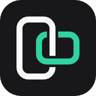
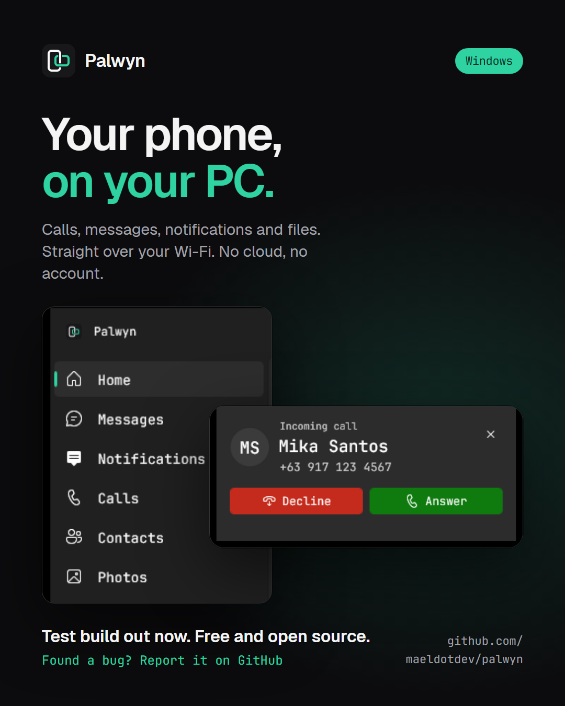
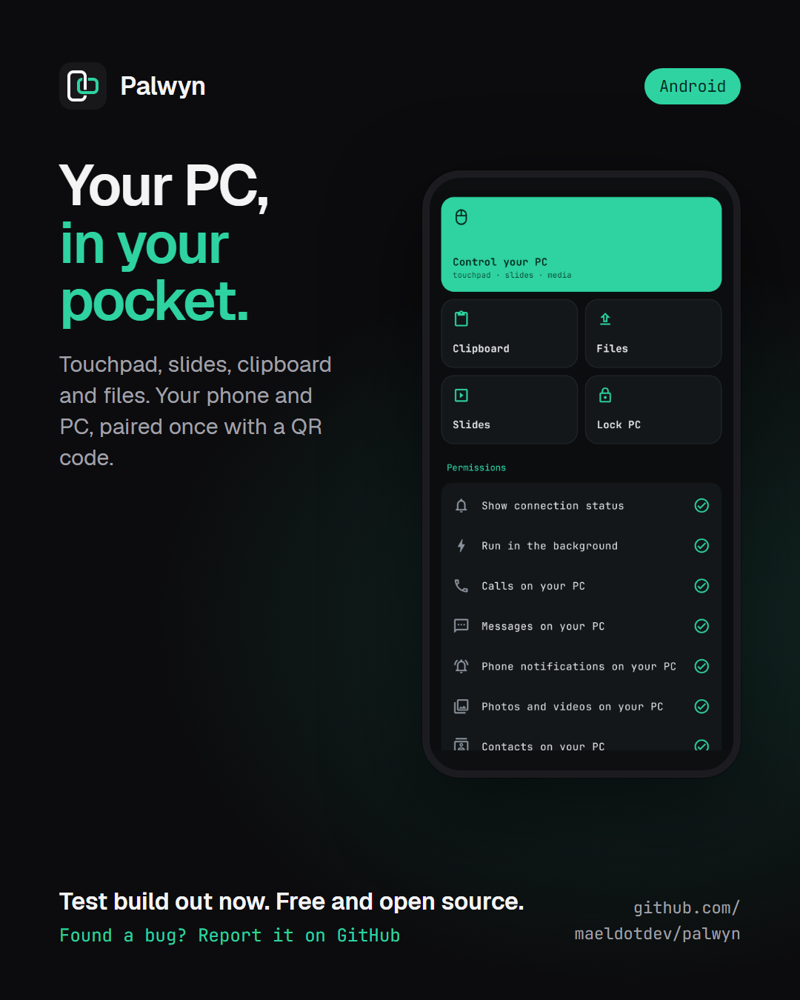

<div align="center">



# Palwyn

**Your Android phone on your Windows PC. No cloud, no account.**

Calls, messages, notifications, photos, files, clipboard and more, sent straight between your phone and your PC over your own Wi-Fi or a USB cable, end-to-end encrypted.

[](LICENSE)


[Website](https://palwyn.vercel.app) · [Download](https://github.com/maeldotdev/palwyn/releases) · [Features](#features) · [Privacy](#privacy-and-security) · [Support](#support-the-project)

<br>

 

<sub>Screenshots use demo data.</sub>

</div>

---

## Why Palwyn

Most phone-to-PC apps route your data through someone else's servers or need an account. Palwyn doesn't. The phone and the PC find each other on your local network, pair once with a QR code, and from then on talk only to each other over mutually authenticated TLS 1.3. Nothing is uploaded, nothing is tracked, and there are no paid plans.

## Features

| | |
|---|---|
| **Calls** | See who's calling on your PC, then answer, decline or hang up. Call history and caller names from your contacts. Audio stays on the phone. |
| **Messages** | Read and reply to SMS from the PC, start new conversations, see MMS pictures and group chats. |
| **Notifications** | Your phone's notifications on your PC, with dismiss and quick reply (WhatsApp, Messenger and others). Searchable history, per-app filters. Optionally, your PC's notifications on your phone. |
| **Photos** | Browse recent photos, videos and albums, then save one or many to your PC. Take a photo with the phone from the PC. |
| **Files** | Quick Drop: send files, folders, text and links in both directions, including from the Windows and Android share menus. |
| **Clipboard** | Text and images copied on the PC arrive on the phone; send the phone's clipboard to the PC with one tap. Password-manager copies are skipped. |
| **Contacts** | Browse, search, add and edit your phone's contacts from the PC. |
| **Phone screen** | View and control your phone's screen in a window on the PC. |
| **Emergency screen** | Phone screen broken? Over a USB cable, see and control it and copy its photos, videos and files, with no prompt on the phone ([prepare it now](docs/install.md#prepare-for-emergencies)). |
| **Remote** | Use the phone as a touchpad and keyboard, a presentation clicker, or a remote for the PC's music, volume and lock screen. Run your own PC commands from the phone. |
| **Everyday extras** | Ring your phone, battery and signal at a glance, media controls, pause PC music during calls, keep the PC awake while connected. |
| **Connection** | Automatic over Wi-Fi, switches to a USB cable when plugged in, or connect by address over a VPN such as Tailscale. |

The full list, with what was verified on real devices, is in the [feature matrix](docs/feature-matrix.md).

### Known limits

Palwyn is honest about what the platforms don't allow:

- **Call audio can't go through the PC.** Windows doesn't let third-party apps use the Bluetooth hands-free profile, so calls are answered from the PC but heard on the phone.
- **SMS only, no RCS.** Google doesn't offer RCS to other apps; RCS chats can still be answered from their notifications.
- **Phone-to-PC clipboard needs a tap.** Android 10 and later don't let background apps read the clipboard.
- **Screen sharing asks for consent.** Android requires the user to allow each screen-sharing session (or once, with "Keep screen sharing ready").
- **One phone connected at a time.** You can pair several and switch between them.

See [Phase 0 feasibility](docs/phase-0-feasibility.md) for the research behind each limit.

## Privacy and security

- **Local only.** No servers, no accounts, no analytics, no ads. Your data moves only between your own devices.
- **Encrypted and pinned.** Every connection is TLS 1.3 with mutual authentication. Each device knows the other's certificate from pairing, so no other device can pose as your phone or PC.
- **Keys stay on the device.** On Android the device key is created inside the Android Keystore and can't be exported.
- **You're in control.** Features that reach deep into your PC (remote control, PC notifications on the phone, clipboard sharing) are off until you turn them on.

The full threat model, what is stored where, and the results of the security audit are in [docs/security.md](docs/security.md). Found a vulnerability? Please report it privately; see [SECURITY.md](SECURITY.md).

## Requirements

| | |
|---|---|
| **PC** | Windows 10 (version 2004) or Windows 11, 64-bit; or Linux, 64-bit (early: everything but the remote, phone screen and USB so far) |
| **Phone** | Android 10 or later |
| **Network** | Phone and PC on the same Wi-Fi for pairing; after that, Wi-Fi, USB cable (with USB debugging) or an address you set |

## Download

Get the Windows, Linux and Android apps from the [Releases](https://github.com/maeldotdev/palwyn/releases) page, then follow the [installation guide](docs/install.md). Or build it yourself; see below.

## Build from source

The repository contains both apps:

```
apps/windows   Windows app: C# / .NET 10 / WinUI 3 (Windows App SDK), system tray
apps/linux     Linux app: C# / .NET 10 / Avalonia, on the same core library
apps/android   Android app: Kotlin / Jetpack Compose
shared         Protocol test vectors shared by both apps
docs           Architecture, protocol, security and test reports
site           The website
```

**Windows**: needs the .NET 10 SDK and Windows developer mode.

```powershell
dotnet test apps/windows/tests/Palwyn.Core.Tests
powershell -File apps/windows/tools/run-dev.ps1   # build, register and launch the Debug app
```

**Android**: needs JDK 17 or later and the Android SDK.

```powershell
cd apps/android
./gradlew testDebugUnitTest assembleDebug
```

More detail, including testing on devices, is in [docs/development.md](docs/development.md).

## Documentation

- [Architecture](docs/architecture.md)
- [Protocol v1](docs/protocol.md) and its [conformance vectors](shared/protocol/test-vectors.json)
- [Security model and audit](docs/security.md)
- [Feature matrix](docs/feature-matrix.md)
- [Reliability](docs/reliability.md) and [performance](docs/performance.md) reports
- [Installation](docs/install.md), [privacy policy](docs/privacy.md) and [code signing policy](docs/code-signing.md)
- [Development and testing](docs/development.md)

## Contributing

Bug reports and ideas are very welcome: open an [issue](https://github.com/maeldotdev/palwyn/issues), or ask in [Discussions](https://github.com/maeldotdev/palwyn/discussions). Code contributions aren't accepted yet; see [CONTRIBUTING.md](CONTRIBUTING.md).

## Support the project

Palwyn is free and always will be. If it's useful to you, you can support its development on [Ko-fi](https://ko-fi.com/mael22).

## License

Palwyn is free software, licensed under the [GNU General Public License v3.0 or later](LICENSE). You can use, study, share and change it. If you share a changed version, it must stay under the same licence, with its source code and the original credits. Third-party components are listed in [NOTICE](NOTICE).

The name **Palwyn** and its logo are not covered by the licence: modified versions must use a different name. See [TRADEMARKS.md](TRADEMARKS.md).

© 2026 Mael
